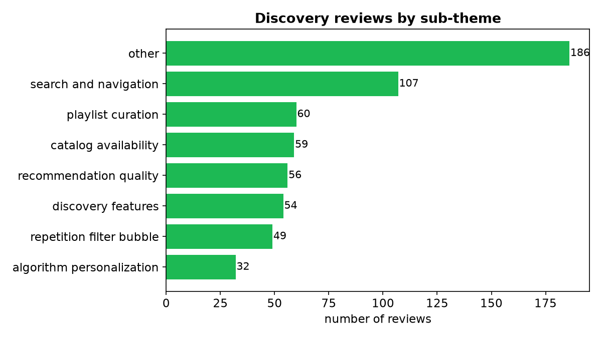
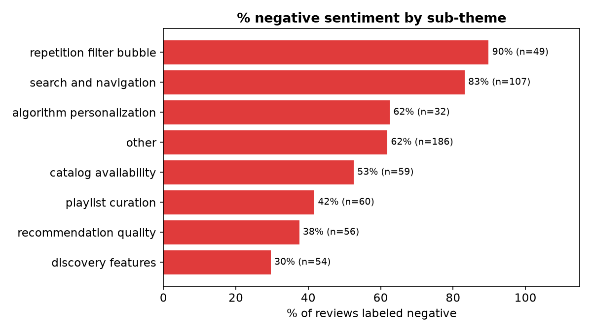

# 🎵 Spotify Music Discovery — AI Review Analysis Pipeline

An AI-powered pipeline that collects Spotify user reviews, filters them to
music-discovery content, tags each review with a theme / sentiment / pain point
using a free LLM, and synthesizes findings that answer key research questions.

📖 **New here?** Read [How it works](HOW_IT_WORKS.md) (plain English) or the
[Architecture](architecture.md) overview.

## ▶️ Try it in Google Colab — no API key needed

[](https://colab.research.google.com/github/Palash1417/Review-Discovery-Engine/blob/main/Spotify_Discovery_Pipeline_Colab.ipynb)

Open the notebook and choose **Runtime → Run all**. Collection, filtering, and
charts run live; the AI tagging + findings are shown from results committed in
this repo, so testers need **no API key**. (An optional cell lets anyone re-run
the AI live with their own free [Groq key](https://console.groq.com/keys).)

## 🖼️ Expected output

After **Runtime → Run all**, you should see roughly the following. (Live
collection counts vary per run; the AI tagging, charts, and report below come
from the committed results, so they're identical every time.)

**Collection & filtering (live):**

```text
Play Store: 250 reviews
App Store: 0 reviews          # 0 is normal from Colab's shared IP (Apple throttling)
Total raw reviews collected live: 250
... discovery-relevant reviews kept
```

**AI tagging (committed results — 453 of 2,033 tagged so far):**

```text
Discovery sub-themes:            Sentiment:
  other                     135    negative   272
  search_and_navigation      81    positive   139
  catalog_availability       49    mixed       40
  playlist_curation          45
  recommendation_quality     41
  discovery_features         39
  repetition_filter_bubble   35
  algorithm_personalization  28
```

**Charts (rendered live from the tagged data):**




**Findings report (excerpt):**

> The most significant frustrations stem from the **repetition filter bubble**
> (89% negative) and **search and navigation** issues (83% negative). Discovery
> is blocked less by a weak algorithm than by friction and loss of control —
> forced shuffle, ads, and song-selection locked behind Premium.

➡️ Full report: [`discovery_insights_report_2000.md`](discovery_insights_report_2000.md)

## 🧭 How to read this analysis (methodology & guidelines)

- **Data:** **2,033** reviews that passed a music-discovery keyword filter, drawn
  from **19,943** collected from Google Play (primary) and the Apple App Store RSS
  feed, within the last 12 months.
- **Tagging:** each review is labeled by an LLM (Llama 3.3 70B via Groq) with a
  `discovery_subtheme`, `sentiment`, and an extracted `pain_point`. Tagging runs
  ~150/day on the free tier — currently **453 of 2,033 tagged**, so the charts and
  report below reflect the tagged subset and refresh as it completes.
- **Synthesis:** a map-reduce pass summarized each sub-theme cluster, then
  combined those with exact Python-computed statistics into the findings below.
- **Read with these caveats:** the dataset is **single-source-dominant** (Google
  Play), **recent** (high review volume compresses the date range), and
  **English-language**. The `other` cluster (~30%) is an off-theme residual —
  treat it as "general app friction," not a discovery finding.

## 📌 Key findings — answers to the research questions

*Grounded in the tagged dataset and the full [`discovery_insights_report_2000.md`](discovery_insights_report_2000.md). Of the 453 tagged so far, sentiment is 60% negative overall.*

**1. Why do users struggle to discover new music?**
Discovery is blocked less by a weak algorithm than by **friction and loss of
control**. Free-tier constraints — forced "smart" shuffle, unskippable ads, and
song-selection locked behind Premium — crowd out exploration, and a shuffle that
replays the same tracks kills variety. The `repetition_filter_bubble` theme is
**89% negative**, and **32%** of reviews mention free/ads/premium.

**2. What are the most common frustrations with recommendations?**
**Unwanted, over-eager suggestions** and weak personalization. Users feel pushed
content they didn't ask for (*"I DO NOT WANT WHAT IS RECOMMENDED TO ME"*) and that
the system over-generalizes from minimal signal (*"the Blend algorithm seems to
think that if I listen to a song one time, I automatically love it"*).
`algorithm_personalization` is 68% negative.

**3. What listening behaviors are users trying to achieve?**
**Uninterrupted, controllable listening** — play a chosen song in a chosen order,
reorder Liked Songs, play playlists in sequence, and curate personal collections.
"Seamless control" recurs across every cluster. Satisfied users *do* want
discovery (Discover Weekly is praised), but the baseline goal is control.

**4. What causes users to repeatedly listen to the same content?**
A **product mechanic, not user preference**: a shuffle that isn't truly random
(*"the shuffle literally only plays the same 20 songs on repeat in the same
order"*), and "smart shuffle" doesn't fix it. This theme is **89% negative**.

**5. Which user segments experience different discovery challenges?**
A clear split by **rating and tier**. Low-raters (1–2★, n=218) cluster on
search/navigation and repetition friction; high-raters (4–5★, n=185) praise
discovery features (*"Discover Weekly reads my mind"*). The **free-tier segment**
(32% of reviews mention ads/free/premium) is the most frustrated, because key
playback controls are paywalled.

**6. What unmet needs emerge consistently across reviews?**
Three recur everywhere: **(a)** an ad-free / minimal-ad experience, **(b)** real
playback control (true shuffle, reorder Liked Songs, play-in-order, repeat), and
**(c)** an **opt-out** from algorithmic feeds and unwanted recommendations.

## Pipeline

| Phase | Script | What it does |
|------|--------|--------------|
| 1 — Collect | `collect_spotify_reviews.py` | Google Play + Apple App Store (free, no-auth) + Reddit (optional, needs PRAW keys). Merges to `spotify_discovery_reviews.csv`. |
| 2 — Tag | `tag_discovery_reviews_groq.py` | Labels each review with `discovery_subtheme`, `sentiment`, `pain_point` via Groq (Llama 3.3 70B). Anthropic/Claude version: `tag_discovery_reviews.py`. |
| 2b — Refine | `refilter_v2.py` | Tighter discovery filter, reusing existing tags. |
| 3 — Analyze | `analyze_discovery_reviews.py` | Map-reduce synthesis → `discovery_insights_report.md`. |
| 4 — Chart | `chart_discovery_reviews.py` | Bar charts (PNG) of themes, sentiment, segments. |

## Run locally

```bash
pip install -r requirements.txt

# Put your free Groq key in a .env file (this file is gitignored):
#   GROQ_API_KEY=gsk_...

python collect_spotify_reviews.py        # Phase 1
python tag_discovery_reviews_groq.py     # Phase 2
python analyze_discovery_reviews.py      # Phase 3
python chart_discovery_reviews.py        # charts
```

## Outputs

**Full dataset (2,033 discovery reviews from 19,943 collected):**
- [`Spotify_Reviews.xlsx`](Spotify_Reviews.xlsx) — all reviews in one Excel workbook (all / discovery / tagged sheets + summary)
- `spotify_discovery_reviews_2000.csv` — all 2,033 discovery reviews
- `spotify_discovery_reviews_2000_tagged.csv` — 2,033 reviews + AI tags
- `discovery_insights_report_2000.md` — findings report · `r2000_chart_*.png` — charts

> ⏳ **Tagging in progress:** AI tagging runs ~150/day (free-tier limit) via
> `tag_2000_daily.py`. The Excel and CSVs cover all 2,033 reviews; the tagged
> columns, charts, and `_2000` report currently reflect the **subset tagged so
> far** and refresh as tagging completes.

**Original smaller run (161 reviews, fully tagged):**
- `spotify_discovery_reviews.csv` · `spotify_discovery_reviews_tagged.csv`
- `discovery_insights_report.md` · `chart_*.png`

## Security
API keys live in `.env`, which is **gitignored** — never commit keys. The
public Colab demo runs key-free by using the committed result files.

## Limitations
Dataset is single-source (Google Play dominates; Apple App Store throttles
cloud IPs), recent (high review volume compresses the date range), and
English-language. Reddit is excluded unless PRAW credentials are supplied.
